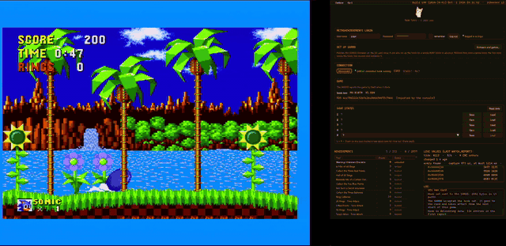
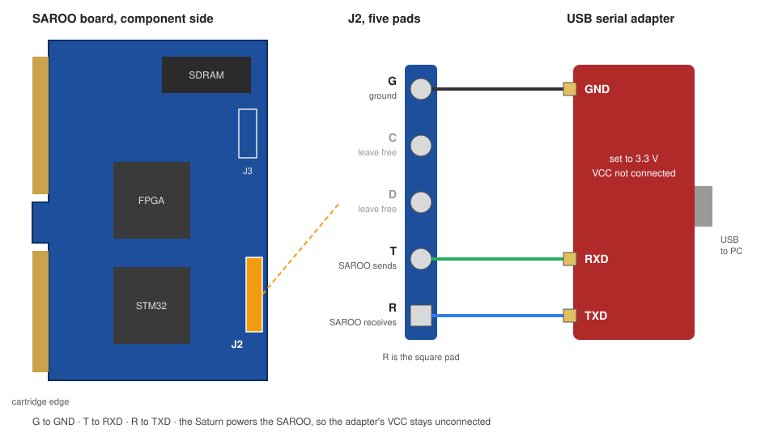

# RAW-TURN

RetroAchievements on a real Sega Saturn. No emulator, no disc patch.

[Deutsche Fassung](README.de.md) · [Project page](https://liquid-wq.github.io/raw-turn/)

RAW-TURN connects a real Sega Saturn, a SAROO cartridge and
RetroAchievements. A small addition to the SAROO firmware reads the values an
achievement set needs while the game runs and passes them to the PC over a
serial adapter. The program on the PC checks the achievements and unlocks them
on your RetroAchievements account. The game itself stays untouched.

When an achievement unlocks, a card appears at the edge of your screen. Under
Options you can show it inside the program window instead.

## What you need

- A SAROO cartridge. RAW-TURN is developed and tested on board revision
  V1.66 (STM32H750). Other revisions with the same chip and the J2 pads may
  work, but are untested. Older boards with an STM32F103 are not supported.
- An original Sega Saturn
- A USB-to-serial adapter set to 3.3 V
- Windows
- A free RetroAchievements account

The adapter goes onto the five pads marked `G C D T R` on the SAROO board,
called J2: G to ground, T to the adapter's RXD, R to the adapter's TXD. C and
D stay free. [docs/WIRING.md](docs/WIRING.md) shows where J2 is and how to
wire it.

## Getting started

1. Download the latest release of the program and start it.
2. Put the SAROO's SD card into your PC. Under **Set up SAROO** click
   **Firmware and games…**, choose the card and click **Patch firmware**.
3. Put the card back into the SAROO and switch the Saturn on. There is no
   firmware update to run in the SAROO menu.
4. Log in with your RetroAchievements account. The program finds the serial
   adapter by itself.
5. Start a game. The first time, the program prepares it and sends the SAROO
   what it needs. From the next start of that game on, the achievements
   count.

The program does not ship any SAROO firmware. It takes the official firmware
v0.9 by tpunix, from your card or straight from the SAROO project's release
page, and applies my patches to it on your PC. Only the two files the SAROO
loads from the card at every start are patched, the STM32 program and the
Saturn program. The FPGA stays the official one. If your card holds a
different firmware, the patched official one replaces it. Whatever was on the
card before is backed up first, and **Restore original** puts it back.

In the same window you can prepare every game on the card in one go. The
program then writes into `saroocfg.txt` and makes a backup of it first.

## Save states

L + R + Down on the pad saves a quick state at once. The last ten quick
states are kept. Four more slots, and loading of all states, are in the
program window under **Save states**, with date, time and play time of each
state. A save or load stops the game for a few seconds.

Loading works best within the same scene of a game. Sound and disc access
are not part of a save state.

The SAROO menu has a new entry, **RetroAchievements**. It lists the games
that are prepared and lets you remove single ones.

## Good to know

Hardcore is not available yet. Every unlock is recorded as Softcore.

## Repository layout

`tool/` holds the program. `saroo/` holds my own additions to the SAROO
firmware, for the Saturn and for the STM32. `docs/` holds the project page
and the wiring guide.

## Bugs and feedback

Please report bugs through [GitHub Issues](https://github.com/liquid-wq/raw-turn/issues),
with the game, your hardware and the log from the program window. That is the
only place I track them.

## License

RAW-TURN is free to use. The source is public to read and audit, but it is
not open source — see [LICENSE](LICENSE). Third-party components are listed
in [THIRD-PARTY-NOTICES.txt](THIRD-PARTY-NOTICES.txt).

There is also a Mega Drive version, [MEGA-RAW](https://github.com/liquid-wq/mega-raw),
and a NES version, [RAW-NES](https://github.com/liquid-wq/raw-nes).

Liqui
